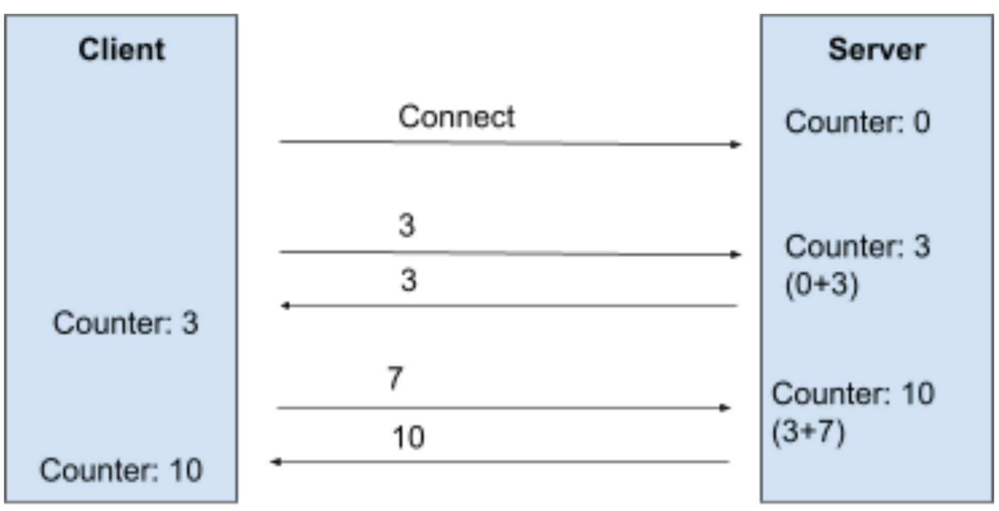

# Presemester Work

Welcome on this repository. Here, you will find a simple implementation of WebSocket communication following the N-version programming.

There are two WebSocket server (Golang and Scala) and two WebSocket clients (Typescript/React and Android/Java).

It follows the Assignment given by the [DEDIS](https://dedis.epfl.ch/) laboratory at EPFL in the context of the [Proof Of Personhood semester project](https://github.com/dedis/popstellar).

## Table of Contents

1. [Specifications](#Specs)
2. [Implementations](#Implem)
   - [Android Client (Java)](./android-client)
   - [React Client (Typescript)](./react-client)
   - [Golang Server](./go-server)
   - [Scala Server](./scala-server)
3. [Project Development Status](#Status)
   - [TODO](#TODO)
   - [Helpful Sources for dev/Documentations](#Res)

## Specifications 

My implementation follows the below specifications:

 

*The Schema comes from the [Assignment Sheet](Assignment.pdf)*

When a connection is established between the server and the client, the server will initialize a counter to 0.

Then the client can send an integer to the server which will add it to the counter and send back the result.

The Following behaviour is implemented:

---

[CONNECTION (1) ]

(client) => 5

5 <= (server) 

(client) => -7

-2 <= (server) 

(client) => "hello"

"NotANumber" <= (server) 

(client) => 3

1 <= (server)

(client) => " "

"NotANumber" <= (server) 

(client) => ""

"NotANumber" <= (server) 

----

Once the connection is closed, the counter is destroyed and it is impossible for the client to resume the previous connection.

## Implementations 

*Click below to have more details on a given implementations*

- #### [Android Client (Java)](./android-client)

- #### [React Client (Typescript)](react-client)

- #### [Golang Server](./go-server)

- #### [Scala Server](./scala-server)

## Project Development Status 

### TODO 

- [x] Typescript/React Client
- [x] Go server
- [x] Scala server: nearly done => some harmonization left to do
- [x] Java/Android Client
- [x] Harmonize code to specs
- [x] Add comments to the code
- [x] Complete and clean git repo
- [x] Clean code

### Helpful Sources for dev/Documentations 

#### - DEDIS

- [Github Repo of the project](https://github.com/dedis/popstellar)

#### - Go (server)

- [Gorilla Explaination video](https://www.youtube.com/watch?v=dniVs0xKYKk&t=172s)
- [Basics tutorial Gorilla](https://tutorialedge.net/golang/go-websocket-tutorial/)

#### - Typescript/React (Client) 

- [Typescript websocket](https://ably.com/topic/websockets-typescript)
- [Websocket Specs](https://websockets.spec.whatwg.org//)
- [Creation of a react app in typescript](https://create-react-app.dev/docs/getting-started)

#### Scala (Server)

- [Akka websocket example](https://github.com/amdelamar/akka-websockets-demo)

#### Android (Client)

- [Scarlet gitub](https://github.com/Tinder/Scarlet)
- [Helpful github issues for Scarlet java](https://github.com/Tinder/Scarlet/issues/12)
- [Scarlet tutorial video](https://www.youtube.com/watch?v=mcVGDtRNRUc)
- [Android cleartext traffic](https://stackoverflow.com/questions/45940861/android-8-cleartext-http-traffic-not-permitted)
- [Android access localhost from emulator](https://inspirnathan.com/posts/34-access-localhost-inside-android-emulator/)
- [Android Error RunOnUiThread](https://developer.android.com/reference/android/app/Activity#runOnUiThread(java.lang.Runnable))

#### - Other Useful stuff

- [Chrome Extension: a simple websocket client](https://chrome.google.com/webstore/detail/simple-websocket-client/pfdhoblngboilpfeibdedpjgfnlcodoo)

