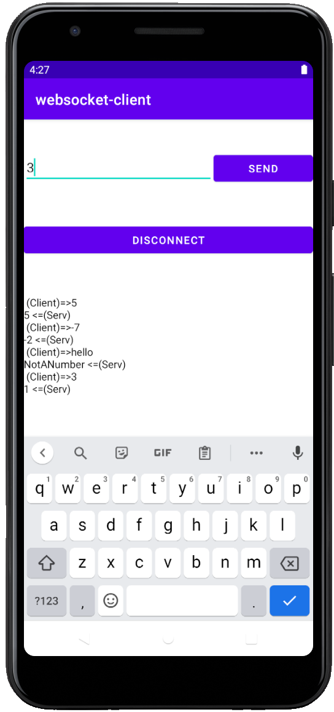

# Android(Java)-Client

Welcome to the android client directory of my small WebSocket program ! 

This is an Android Studio project. It has been coded with the targetted SDK 31.

If you run it on android AVD with the server in local. The localhost IP become 10.0.2.2. Therefore in the address field you should input ws://10.0.2.2/ws 

Here are some screenshot:
</img></img>

