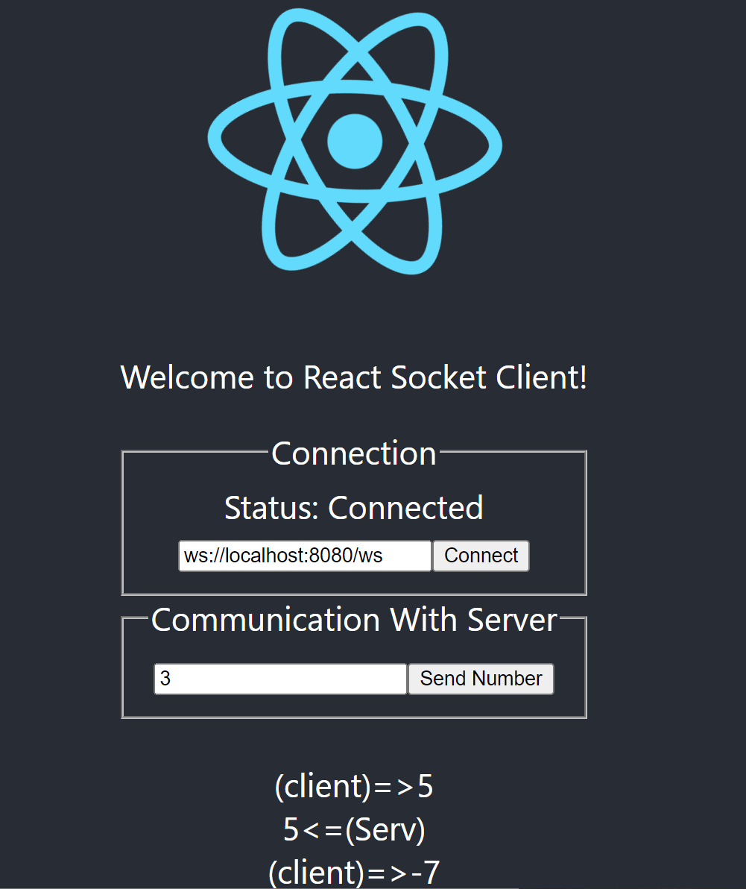

# React(Typescript)-Client

Welcome to the React client directory of my small WebSocket program !

### To Run in Debug/Development mode

type `npm start`

Then access the webpage at `http://localhost:3000` 

</img>

*Screenshot of the client*

#### Information: 

- This project was bootstrapped with [Create React App](https://github.com/facebook/create-react-app).

- It uses [WebSocket Library](https://www.npmjs.com/package/websocket)

  
